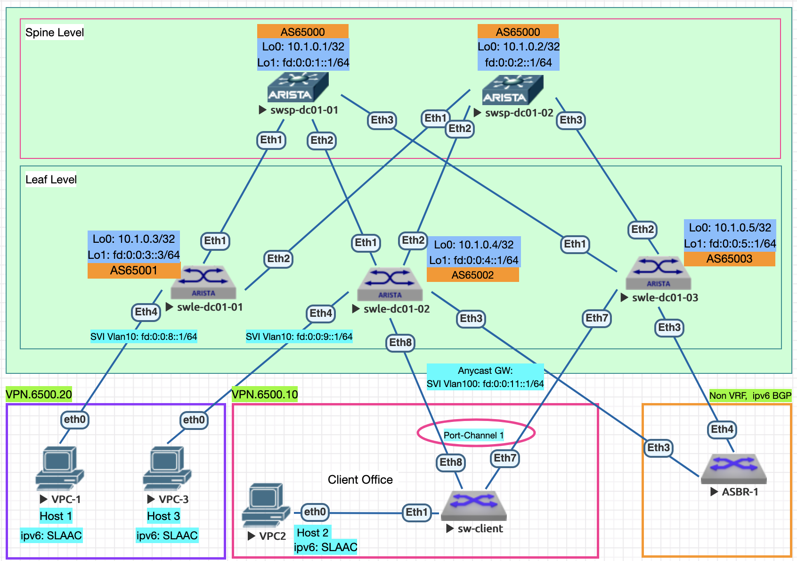

# Проектная работа
## Проектирование сетевой фабрики на основе VxLAN EVPN для IPv6 потребителей с eBGP в Underlay на оборудовании Arista

### Цели:
- Спроектировать фабрику в соответствии с архитекторой Клоза в среде эмуляции EVE-NG;
- Предложить типовые решения по подключению потребителей в режиме assymetric IRB, MC-LAG (ESI LAG);
- Предложить решение для подключения фабрики к внешней сети;
- Предложить варианты оборудования для использования в фабрике от Arista;

### Адресный план и особенности подготовки среды

#### Правила именования коммутаторов:
   - Spine коммутаторы: swsp-dc0[DC_num]-num
   - Leaf коммутаторы: swle-dc0[DC_num]-num

#### Адресный план
- Адреса для Loopback интерфейсов ipv4: 10.00[DC num].0.0/23, 512 устройств на 1 DC, Таблица №1;
- Адреса для Loopback интерфейсов ipv6: fd::/61 в соответствии с Таблицей №1;
- Линковые адреса ipv4: 10.10[DC_num].16.0/20, для линковых сетей использовать /31, младший адрес на стороне Spine;
- Линковые адреса 'Spine - Leaf' ipv6: link-local
- Линковые интерфейсы 'Spine - Leaf' в 10 vlan (подинтерфейсы Eth [0..n].10, с тэгом 802.1q 10)

#### Таблица №1 Имена хостов и адреса Loopback, AS Number
| Коммутатор  | Hostname  |  IP Loopback 0 | IP Loopback 1 | BGP AS Number |
| :------------ |:---------------:| :-----:| :---------------:| :-------------:|
| Spine 1      | swsp-dc01-01 | 10.1.0.1 | fd:0:0:1::1/64 | 65000 |
| Spine 2      | swsp-dc01-02 |   10.1.0.2 | fd:0:0:2:1/64 | 65000 |
| Leaf 1 | swle-dc01-01 |    10.1.0.3 | fd:0:0:3::1/64 | 65001 |
| Leaf 2 | swle-dc01-02 |    10.1.0.4 | fd:0:0:4::1/64 | 65002 |
| Leaf 3 | swle-dc01-03 |    10.1.0.5 | fd:0:0:5::1/64 | 65003 |

#### Таблица №2 Настройки устройств подключенных к фабрике
| Клиентское устройство  | IPv4 адрес |  IPv4 шлюза |  IPv6 router |  IPv6 интерфейса хоста |
| :------------: |:---------------:| :-----:| :---------------:| :-----:| 
| Host-1 | - |     - | fd:0:0:8::1/64 |     SLAAC | 
| Host-3 | - |     - | fd:0:0:9::1/64 |     SLAAC | 
| Host-2/LACP | - |    - | fd:0:0:11::1/64 |    SLAAC | 
| Host-2/LACP | - |    - | fd:0:0:11::1/64 |   SLAAC |

*** Host-2 подключен через клиентский коммутатор с включенной агрегацией каналов LACP в режиме Active в демонстративных целях функционала Multihoming***

#### Таблица №3 Настройки IP VRF
| VRF  | IPv6 network | RD | RT Both | VNI |
| :------------: |:---------------:| :-----:| :---------------:| :---------------:|
| VPN.6500.10 | fd:0:0:8::1/64 |     65000:10 | 65000:10 | 10010 |
| VPN.6500.20 | fd:0:0:11::1/64 |    65000:20 | 65000:20 | 10020 |

### Общая сетевая схема (L2/L3)

### [Проект в PDF](configs/Project-RRG-last.pdf)

### Конфигурации устройств
- Spine коммутаторы:
  - [swsp-dc1-1](configs/swsp-dc01-01.conf)
  - [swsp-dc1-2](configs/swsp-dc01-02.conf)
- Leaf коммутаторы:
  - [swle-dc1-1](configs/swle-dc01-01.conf)
  - [swle-dc1-2](configs/swle-dc01-02.conf)
  - [swle-dc1-3](configs/swle-dc01-03.conf)
- ASBR
  - [asbr-1](configs/asbr-1)
- Client switch
  - [client-sw](configs/client-sw.conf)
    
### Темы документа

### Базовая настройка и проверки для BGP underlay и использовании ipv6 

### Подключение потребителей по схеме symmetric IRB

 Нужно добавить еще один Host-3 в VPN, где живет Host-1, показать работу

### Подключение потребителей к двум Leaf устройствам (ESI LAG)
Мультихоминг, Host-2

###  Подключение фабрики к внешей сети
Поднять BGP в каждом VPN с пограничным маршрутизатором 

  
