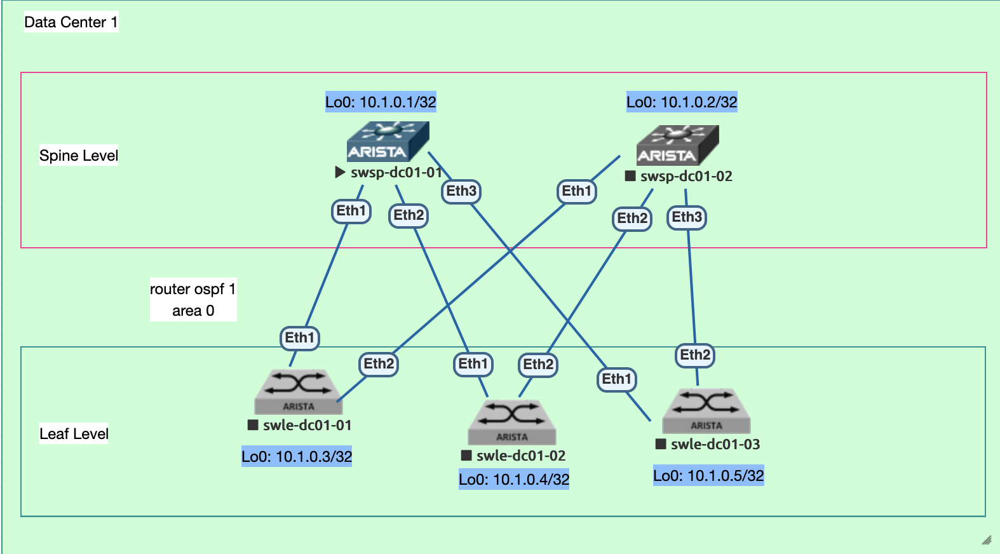

### 1. Проектирование адресного пространства
- Собрать схему CLOS;
- Распределить адресное пространство;        
### 2. Адресный план и правила именования коммутаторов:
     
- Общий план адресов: 10.0.0.0/8;
- Адреса для Loopback интерфейсов: 10.00[DC num].0.0/23, 512 устройств на 1 DC;
- Линковые адреса: 10.10[DC_num].16.0/20, для линковых сетей использовать /31, младший адрес на стороне Spine;
- Правила именования коммутаторов:
   - Spine Hostname: swsp-dc[DC_num]-num
   - Leaf Hostname: swle-dc[DC_num]-num

#### Таблица №1 Имена хостов и адреса Loopback
| Коммутатор  | Hostname  |  IP Loopback 0 |
| :------------ |:---------------:| -----:|
| Spine 1      | swsp-dc01-01 | 10.1.0.1 |
| Spine 2      | swsp-dc01-02 |   10.1.0.2 |
| Leaf 1 | swle-dc01-01 |    10.1.0.3 |
| Leaf 2 | swle-dc01-02 |    10.1.0.4 |
| Leaf 3 | swle-dc01-03 |    10.1.0.5 |

#### Таблица №2 Линковые сети //младший ip подсети на интерфейсе spine
| Коммутатор  | swsp-dc01-01  |  swsp-dc01-01 |
| :------------ |:---------------:| -----:|
| swle-dc01-01 | 10.101.0.0/31 |    10.101.0.2/31 |
| swle-dc01-02 | 10.101.0.4/31 |    10.101.0.6/31 |
| swle-dc01-03 | 10.101.0.8/31 |    10.101.0.10/31 |
### 3. Сетевая схема
    
### 4. План выполнения работ:
#### 4.1 Выполнить коммутацию согласно схемы (раздел 3);
#### 4.2 Выполнить настройку коммутаторов:
   - настроить аутентификацию и авторизацию по умолчанию для консоли;
   - создать пользователя 'user' с паролем 'user';
   - создать пароль для привиллегированного режима enable secret 'user';
   - отключить разрешение имен доменов в консоли;
   - присвоить имена коммутаторам в соответствии с адресным планом;
   - настроить ntp (при наличии серверов времени);
   - настроить логгирование (syslog по необходимости);
   - отключить на всех портах switching 'no switchport';
   - настроить линковые адреса в соответствии с адресным планом;
   - настроить адреса интерфейсов 'loopback 0';
   - все неиспользуемые интерфейсы выключить;
<!--- 
   - включить маршрутизацию (ip routing, ip cef);
   - настроить процесс маршрутизации router ospf 1, использовать только area 0;
   - выполнить настройку router ospf 1 default maximum-paths (= 16 маршрутов ECMP)
   - настроить поведение по умолчанию passive для интерфейсов;
   - настроить router id loopback 0;
   - настроить на линковых интерфейсах ip ospf network type point-to-point (исключить выборы DR/BDR);
   - настроить на линковых интерфейсах игнорирование mtu для ospf;
   - настроить на линковых интерфейсах метод аутентификации md5, задать key '123';
   - настроить bfd на всех линковых интерфейсах;-->
### 5. План тестирования и диагностики:
  - проверить корректность назначения ip адресов в соответствии с таблицей №2 (show ip int br);
  <!--- - Убедиться в наличии соседских отношений по ospf (sh ip ospf summary/neighbor/database detail);
   - Убедиться в наличии маршрутов адресов loopback spine/leaf на коммутаторах leaf;
   - Убедиться в работоспособности ECMP (наличие более одной записи для префиксов loopback в sh ip route ospf/sh ip ospf databas detail)
-->
