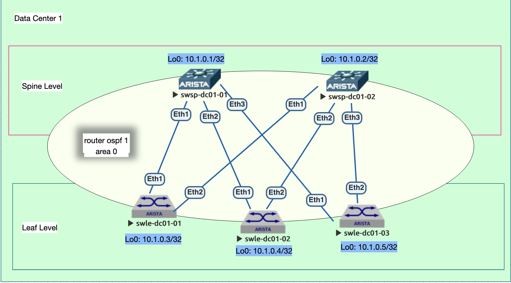

### 1. Underlay. OSPF
Цель: Настроить OSPF для Underlay сети

    Настройте OSPF в Underlay сети, для IP связанности между всеми сетевыми устройствами.
    Зафиксируете в документации - план работы, адресное пространство, схему сети, конфигурацию устройств
    Убедитесь в наличии IP связанности между устройствами в OSFP домене

### 2. Сетевая схема
  


### 3. План выполнения работ
#### 3.1 Предусловие
Выполнена коммутация, настроены линковые интерфейсы и Loopback адреса в соответствии с [Заданием 1](https://github.com/rinatkaa/DataCenterLabs/tree/7e59cc8ceb32a081ec70271e0248e5d9934b8caa/lab01)


#### 3.2 Настроить процесс маршрутизации OSPF
- Используется только Area 0;
- С целью безопасности, выключить OSPF на всех интерфейсах;
- ECMP по умолчанию (128 одинаковых маршрутов для Arista);
- Настроена редистрибуция connected маршрутов, для адресов Loopback с применением route-map + prefix-list;
- Включить функционал BFD для интерфейсов на которых работает OSPF;
  
##### 3.2.1 Фрагмент конфигурации route-map + prefix-list:
```
  ip prefix-list redistribute-connected-pl
   seq 10 permit 10.1.0.0/24 ge 32
!
route-map redistribute-connected-map permit 10
   match ip address prefix-list redistribute-connected-pl
!
```

##### 3.2.2 Фрагмент конфигурации процесса OSPF:
```
router ospf 1
   router-id 10.1.0.1
   bfd default
   no passive-interface Ethernet1
   no passive-interface Ethernet2
   no passive-interface Ethernet3
   redistribute connected route-map redistribute-connected-map
   network 10.101.0.0/16 area 0.0.0.0
   max-lsa 12000
   log-adjacency-changes detail
```

#### 3.3 Настроить атрибуты протокола OSPF на интерфейсах
- Включить аутентификацию сообщений с вычислением md5 хэша;
- Ключ аутентификации 'cisco' без кавычек;
- Выключить зависимость от IP MTU;
- Выключить выборы DR/BDR;
- оптимизировать таймеры (helo 1 секунда, dead 3 секунды);

##### 3.3.1 Фрагмент конфигурации интерфейсов:
```
interface Ethernet1
   description - Downlink to Leaf-1
   no switchport
   ip address 10.101.0.2/31
   ip ospf dead-interval 3
   ip ospf hello-interval 1
   ip ospf network point-to-point
   ip ospf authentication message-digest
   ip ospf authentication-key 7 sgGTXDsuogyB28zWDbh8/Q==
   ip ospf mtu-ignore
```

### 3.4 Выполнить контроль и проверки

- Убедиться в том, что соседские отношения подняты (проверку выполняем на spine):
```
swsp-dc1-02#sh ip osp neighbor
Neighbor ID     Instance VRF      Pri State                  Dead Time   Address         Interface
10.1.0.3        1        default  0   FULL                   00:00:01    10.101.0.3      Ethernet1
10.1.0.4        1        default  0   FULL                   00:00:01    10.101.0.7      Ethernet2
10.1.0.5        1        default  0   FULL                   00:00:01    10.101.0.11     Ethernet3
```

- Убедиться в наличии маршрутов адресов Loopback коммутаторов и работе ECMP:

##### Наличие маршрута 10.1.0.1/32 (Spine-1 loopback 0) через каждый из leaf свидетельствуют о корректной работе ECMP.
```
swsp-dc1-02#sh ip route ospf

VRF: default
Codes: C - connected, S - static, K - kernel,
       O - OSPF, IA - OSPF inter area, E1 - OSPF external type 1,
       E2 - OSPF external type 2, N1 - OSPF NSSA external type 1,
       N2 - OSPF NSSA external type2, B - Other BGP Routes,
       B I - iBGP, B E - eBGP, R - RIP, I L1 - IS-IS level 1,
       I L2 - IS-IS level 2, O3 - OSPFv3, A B - BGP Aggregate,
       A O - OSPF Summary, NG - Nexthop Group Static Route,
       V - VXLAN Control Service, M - Martian,
       DH - DHCP client installed default route,
       DP - Dynamic Policy Route, L - VRF Leaked,
       G  - gRIBI, RC - Route Cache Route

 O E2     10.1.0.1/32 [110/1] via 10.101.0.3, Ethernet1
                              via 10.101.0.7, Ethernet2
                              via 10.101.0.11, Ethernet3
 O E2     10.1.0.3/32 [110/1] via 10.101.0.3, Ethernet1
 O E2     10.1.0.4/32 [110/1] via 10.101.0.7, Ethernet2
 O E2     10.1.0.5/32 [110/1] via 10.101.0.11, Ethernet3
 O        10.101.0.0/31 [110/20] via 10.101.0.3, Ethernet1
 O        10.101.0.4/31 [110/20] via 10.101.0.7, Ethernet2
 O        10.101.0.8/31 [110/20] via 10.101.0.11, Ethernet3
```
- Аналогично убеждаемся в корректности настройки на стороне leaf:

```
swle-dc01-01#sh ip route ospf

VRF: default
Codes: C - connected, S - static, K - kernel,
       O - OSPF, IA - OSPF inter area, E1 - OSPF external type 1,
       E2 - OSPF external type 2, N1 - OSPF NSSA external type 1,
       N2 - OSPF NSSA external type2, B - Other BGP Routes,
       B I - iBGP, B E - eBGP, R - RIP, I L1 - IS-IS level 1,
       I L2 - IS-IS level 2, O3 - OSPFv3, A B - BGP Aggregate,
       A O - OSPF Summary, NG - Nexthop Group Static Route,
       V - VXLAN Control Service, M - Martian,
       DH - DHCP client installed default route,
       DP - Dynamic Policy Route, L - VRF Leaked,
       G  - gRIBI, RC - Route Cache Route

 O E2     10.1.0.1/32 [110/1] via 10.101.0.1, Ethernet1
 O E2     10.1.0.2/32 [110/1] via 10.101.0.2, Ethernet2
 O E2     10.1.0.4/32 [110/1] via 10.101.0.1, Ethernet1
                              via 10.101.0.2, Ethernet2
 O E2     10.1.0.5/32 [110/1] via 10.101.0.1, Ethernet1
                              via 10.101.0.2, Ethernet2
 O        10.101.0.4/31 [110/20] via 10.101.0.1, Ethernet1
 O        10.101.0.6/31 [110/20] via 10.101.0.2, Ethernet2
 O        10.101.0.8/31 [110/20] via 10.101.0.1, Ethernet1
 O        10.101.0.10/31 [110/20] via 10.101.0.2, Ethernet2
```

- Обращаем внимание на наличие в таблице маршрутизации более 1 маршрута для Loopback интерфейсов двух других Leaf коммутаторов:
    - 10.1.0.4/32
    - 10.1.0.5/32

- Выполняем проверку связности между адресами Loopback Leaf коммутаторов:
```
swle-dc01-01#ping 10.1.0.4 size 1500 df-bit source loopback 0
PING 10.1.0.4 (10.1.0.4) from 10.1.0.3 : 1472(1500) bytes of data.
1480 bytes from 10.1.0.4: icmp_seq=1 ttl=63 time=22.9 ms
1480 bytes from 10.1.0.4: icmp_seq=2 ttl=63 time=31.7 ms
1480 bytes from 10.1.0.4: icmp_seq=3 ttl=63 time=34.5 ms
```

### 4 Конфигурации устройств
- Spine коммутаторы:
  - [swsp-dc1-1](configs/swsp-dc1-01-config.txt)
  - [swsp-dc1-2](configs/swsp-dc1-02-config.txt)
- Leaf коммутаторы:
  - [swle-dc1-1](configs/swle-dc1-01-config.txt)
  - [swle-dc1-2](configs/swle-dc1-02-config.txt)
  - [swle-dc1-3](configs/swle-dc1-03-config.txt)
