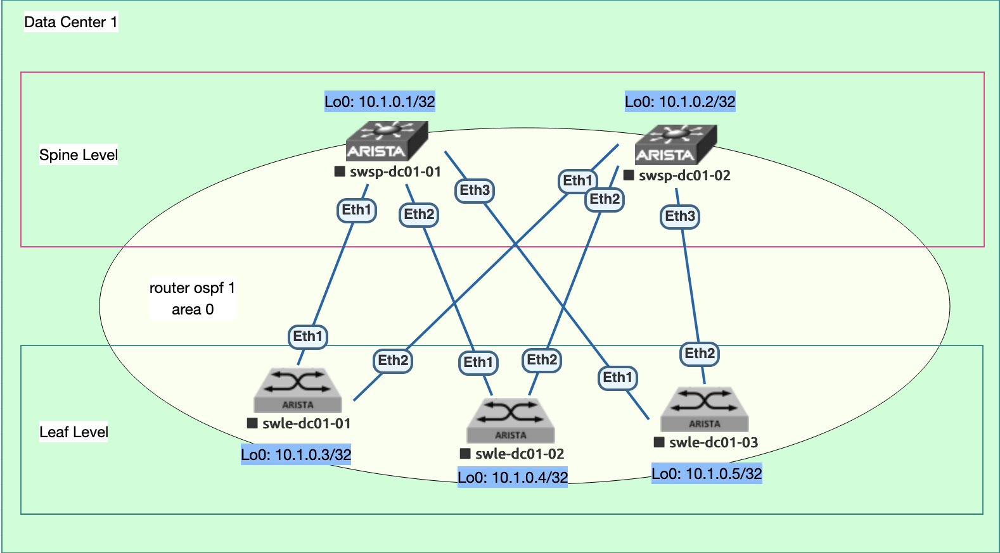

### Underlay. OSPF
Цель: Настроить OSPF для Underlay сети

    Настроите OSPF в Underlay сети, для IP связанности между всеми сетевыми устройствами.
    Зафиксируете в документации - план работы, адресное пространство, схему сети, конфигурацию устройств
    Убедитесь в наличии IP связанности между устройствами в OSFP домене

###  Сетевая схема
    

### План выполнения работ
#### Предусловие
Выполнена коммутация и назначены IP адреса в соответствии с Заданием 1 (ссылка)

####  Настроить процесс маршрутизации OSPF

#### Настроить атрибуты протокола OSPF на интерфейсах

### Настроить BFD

### Выполнить контроль и проверки

### Конфигурации устройств
