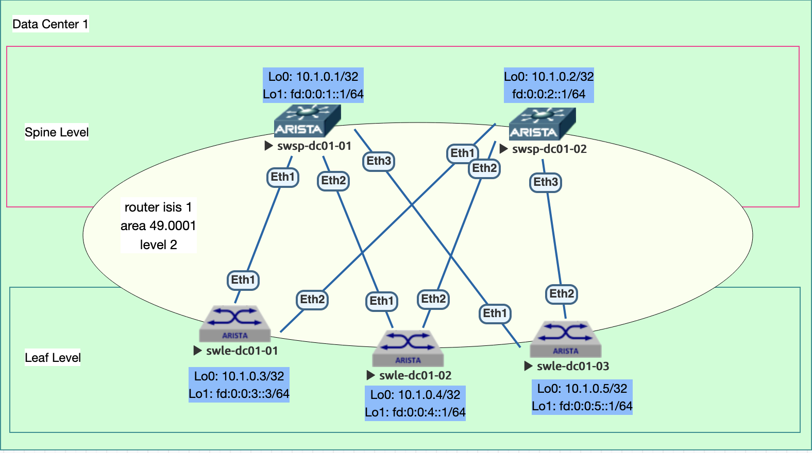

Домашнее задание

Underlay. IS-IS
Цель:

Настроить IS-IS для Underlay сети с использованием ipv6

Описание/Пошаговая инструкция выполнения домашнего задания:

В этой самостоятельной работе мы ожидаем, что вы самостоятельно:

    Настроите ISIS в Underlay сети, для IP связанности между всеми сетевыми устройствами.
    Зафиксируете в документации - план работы, адресное пространство, схему сети, конфигурацию устройств
    Убедитесь в наличии IP связанности между устройствами в ISIS домене


### 2. Адресный план и правила именования коммутаторов:

На устройствах одновременно настраивается оба стека IPv4, IPv6 с отдельными процессами маршрутизации.
Протокол ISIS настривается для IPv6
      
- Общий план адресов ipv4: 10.0.0.0/8;
- Адреса для Loopback интерфейсов ipv4: 10.00[DC num].0.0/23, 512 устройств на 1 DC;
- #### Адреса для Loopback интерфейсов ipv6: fd::/61 в соответствии с таблицей №1;
- Линковые адреса ipv4: 10.10[DC_num].16.0/20, для линковых сетей использовать /31, младший адрес на стороне Spine;
- #### Линковые адреса ipv6: link-local
- Правила именования коммутаторов:
   - Spine Hostname: swsp-dc0[DC_num]-num
   - Leaf Hostname: swle-dc0[DC_num]-num
- Линковые интерфейсы для стека ipv4: основной интерфейс Eth [0..n] //сохраняю для будущих лаб, не используется в данной лабе
- #### Линковые интерфейсы для стека ipv6: подинтерфейс Eth [0..n].10, с тэгом 802.1q 10
  
#### Таблица №1 Имена хостов и адреса Loopback
| Коммутатор  | Hostname  |  IP Loopback 0 | IP Loopback 1 | System ID |
| :------------ |:---------------:| -----:| ---------------:| -------------:|
| Spine 1      | swsp-dc01-01 | 10.1.0.1 | fd:0:0:1::1/64 | 0000.0000.0001 |
| Spine 2      | swsp-dc01-02 |   10.1.0.2 | fd:0:0:2:1/64 |0000.0000.0002 |
| Leaf 1 | swle-dc01-01 |    10.1.0.3 | fd:0:0:3::1/64 | 0000.0001.0001 |
| Leaf 2 | swle-dc01-02 |    10.1.0.4 | fd:0:0:4::1/64 | 0000.0001.0002 |
| Leaf 3 | swle-dc01-03 |    10.1.0.5 | fd:0:0:5::1/64 | 0000.0001.0003 |


  


### 3. План выполнения работ
#### 3.1 Подготовительные работы
Выполнена коммутация согласно п.2, настроены линковые интерфейсы и интерфейсы Loopback 1

### 3.1.1 Включить ipv6 форвардинг:
```
ipv6 unicast-routing
```
### 3.1.2 Настроить линковые интерфейсы для ipv6
Достаточно настройки link-local адресации для обеспечения форвардинга пакетов в пределах фабрики.
```
interface Ethernet2.10
   description - Uplink to Spine-2
   encapsulation dot1q vlan 10
   ipv6 enable
```
                        

#### 3.2 Настроить процесс маршрутизации ISIS
- Используется только Area 49.0001;
- Используется только один тип отношений между устройствами level-2 - этого достаточно для работы фабрики и редистрибьюции коннектед маршрутов;
- ECMP по умолчанию (128 одинаковых маршрутов для Arista);
- Настроена редистрибуция connected маршрутов, для адресов Loopback с применением route-map + prefix-list;
- Включить функционал BFD для интерфейсов на которых работает ISIS;

  
##### 3.2.1 Фрагмент конфигурации route-map + prefix-list:
```
ip prefix-list redistribute-connected-pl
   seq 10 permit 10.1.0.0/24 ge 32
!
ipv6 prefix-list rc6-pl
   seq 10 permit fd::/61 ge 64
```

##### 3.2.2 Фрагмент конфигурации процесса ISIS:
```
router isis 1
   net 49.0001.0000.0000.0003.00
   is-type level-2
   redistribute connected route-map rc6-map
   !
   address-family ipv6 unicast
```

#### 3.3 Настроить атрибуты протокола ISIS на интерфейсах
- включить на интерфейсе протокол ISIS;
- включить network type point-to-point;
- включить аутентификацию сообщений с вычислением md5 хэша;
- ключ аутентификации 'cisco' без кавычек;

##### 3.3.1 Фрагмент конфигурации интерфейсов:
```
interface Ethernet1.10
   description - Uplink to Spine-1
   encapsulation dot1q vlan 10
   ipv6 enable
   isis enable 1
   isis network point-to-point
   isis authentication mode md5
   isis authentication key 7 KHWA0XKKZeJG8f+/WzG88A==
```

### 3.4 Выполнить контроль и проверки

Проверка настройки ipv6 (Leaf 3): 
```
swle-dc01-03#sh ipv6 int br
Interface  Status    MTU   IPv6 Address                 Addr State  Addr Source
---------- ------- ------ ---------------------------- ------------ -----------
Et1.10     up       1500   fe80::5200:ff:fe15:f4e8/64   up          link local
Et2.10     up       1500   fe80::5200:ff:fe15:f4e8/64   up          link local
Lo1        up      65535   fe80::ff:fe00:0/64           up          link local
                           fd:0:0:5::1/64               up          config
```

Проверка связности с соседом по ipv6 по link-local:
```
swle-dc01-03#show ipv6 neighbors ethernet2.10
IPv6 Address                                  Age Hardware Addr    State Interface
fe80::5200:ff:fe03:3766                   0:00:30 5000.0003.3766   REACH Et2.10
```

```
swle-dc01-03#ping ipv6 fe80::5200:ff:fe03:3766 interface ethernet 2.10 size 1500
PING fe80::5200:ff:fe03:3766(fe80::5200:ff:fe03:3766) from fe80::5200:ff:fe15:f4e8%et2.10 et2.10: 1452 data bytes
1460 bytes from fe80::5200:ff:fe03:3766%et2.10: icmp_seq=1 ttl=64 time=14.1 ms
1460 bytes from fe80::5200:ff:fe03:3766%et2.10: icmp_seq=2 ttl=64 time=19.3 ms
```
   

- Убедиться в том, что соседские отношения подняты (проверку выполняем на leaf-3):
```
swle-dc01-03#sh isis neighbors

Instance  VRF      System Id        Type Interface          SNPA              State Hold time   Circuit Id
1         default  swsp-dc01-01     L2   Ethernet1.10       P2P               UP    27          20
1         default  swsp-dc01-02     L2   Ethernet2.10       P2P               UP    29          1E
```

- Убедиться в наличии маршрутов адресов Loopback 1 коммутаторов leaf и работе ECMP:

```
swle-dc01-03#sh ipv6 route

VRF: default
Displaying 5 of 10 IPv6 routing table entries
Codes: C - connected, S - static, K - kernel, O3 - OSPFv3,
       B - Other BGP Routes, A B - BGP Aggregate, R - RIP,
       I L1 - IS-IS level 1, I L2 - IS-IS level 2, DH - DHCP,
       NG - Nexthop Group Static Route, M - Martian,
       DP - Dynamic Policy Route, L - VRF Leaked,
       RC - Route Cache Route

 I L2     fd:0:0:1::/64 [115/11]
           via fe80::5200:ff:fed5:5dc0, Ethernet1.10
 I L2     fd:0:0:2::/64 [115/11]
           via fe80::5200:ff:fe03:3766, Ethernet2.10
 I L2     fd:0:0:3::/64 [115/21]
           via fe80::5200:ff:fed5:5dc0, Ethernet1.10
           via fe80::5200:ff:fe03:3766, Ethernet2.10
 I L2     fd:0:0:4::/64 [115/21]
           via fe80::5200:ff:fed5:5dc0, Ethernet1.10
           via fe80::5200:ff:fe03:3766, Ethernet2.10
 C        fd:0:0:5::/64 [0/1]
           via Loopback1, directly connected
```

##### Наличие маршрута fd:0:0:3::/64 и fd:0:0:4::/64 (loopback 1 leaf-1 и leaf-2) через оба spine, свидетельствуют о корректной работе ECMP.

Дополнительно вывод routing information base для ipv6 префикса fd:0:0:3::/64, свидетельствует о том же:

```
swle-dc01-03#sh rib route ipv6 fd:0:0:3::/64
VRF: default
Codes: C - Connected, S - Static, P - Route Input
       B - BGP, O - OSPF, O3 - OSPF3, I - IS-IS
       > - Best Route, * - Unresolved Nexthop
       L - Part of a recursive route resolution loop
>I    fd:0:0:3::/64 [115/21]
         via fe80::5200:ff:fed5:5dc0, Ethernet1.10
         via fe80::5200:ff:fe03:3766, Ethernet2.10
```


- Выполняем проверку связности между адресами Loopback Leaf коммутаторов:
```
swle-dc01-01#ping 10.1.0.4 size 1500 df-bit source loopback 0
PING 10.1.0.4 (10.1.0.4) from 10.1.0.3 : 1472(1500) bytes of data.
1480 bytes from 10.1.0.4: icmp_seq=1 ttl=63 time=22.9 ms
1480 bytes from 10.1.0.4: icmp_seq=2 ttl=63 time=31.7 ms
1480 bytes from 10.1.0.4: icmp_seq=3 ttl=63 time=34.5 ms
```

### 4 Конфигурации устройств
- Spine коммутаторы:
  - [swsp-dc1-1](configs/swsp-dc1-01.conf)
  - [swsp-dc1-2](configs/swsp-dc1-02.conf)
- Leaf коммутаторы:
  - [swle-dc1-1](configs/swle-dc1-01.conf)
  - [swle-dc1-2](configs/swle-dc1-02.conf)
  - [swle-dc1-3](configs/swle-dc1-03.conf)
