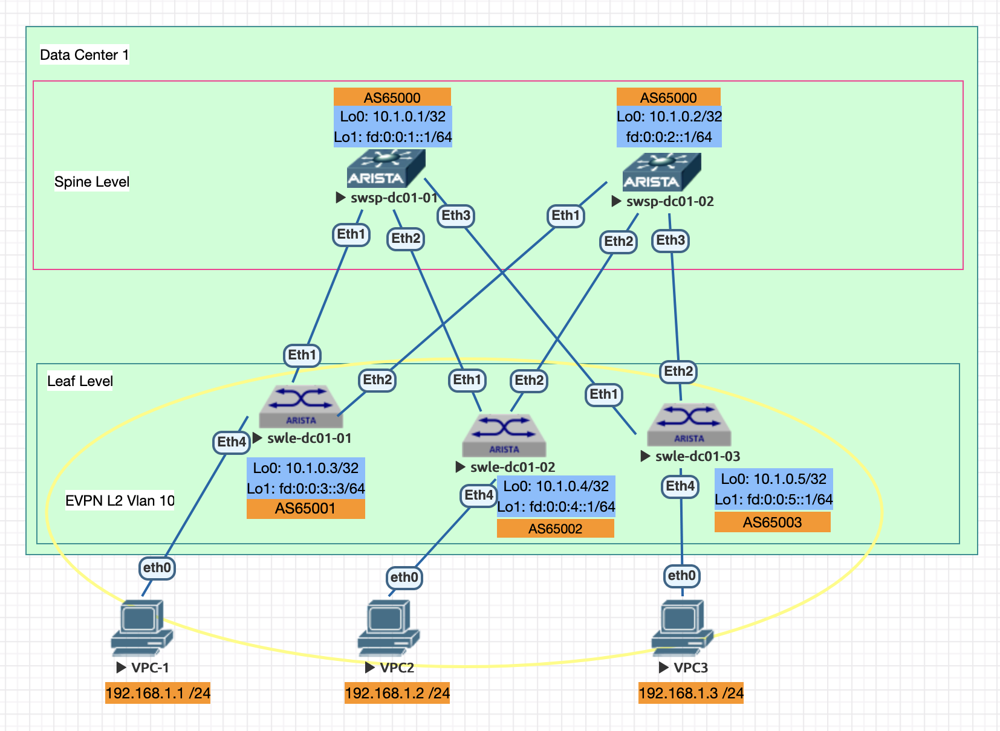

Домашнее задание

VxLAN. L2 VNI
Цель:

Настроить Overlay на основе VxLAN EVPN для L2 связанности между клиентами

Описание/Пошаговая инструкция выполнения домашнего задания:

В этой самостоятельной работе мы ожидаем, что вы самостоятельно:

    Настроите BGP peering между Leaf и Spine в AF l2vpn evpn
    Настроите связанность между клиентами в первой зоне и убедитесь в её наличии
    Зафиксируете в документации - план работы, адресное пространство, схему сети, конфигурацию устройств

Документация оформлена на github в файле Readme.md(markdown). Каждая лабораторная работа находится в своей директории. 

### 2. Адресный план и правила именования коммутаторов:

Протокол eBGP настривается для работы с IPv6 адресацией.
      
- Общий план адресов ipv4: 10.0.0.0/8;
- Адреса для Loopback интерфейсов ipv4: 10.00[DC num].0.0/23, 512 устройств на 1 DC;
- #### Адреса для Loopback интерфейсов ipv6: fd::/61 в соответствии с таблицей №1;
- Линковые адреса ipv4: 10.10[DC_num].16.0/20, для линковых сетей использовать /31, младший адрес на стороне Spine;
- #### Линковые адреса ipv6: link-local
- Правила именования коммутаторов:
   - Spine Hostname: swsp-dc0[DC_num]-num
   - Leaf Hostname: swle-dc0[DC_num]-num
- Линковые интерфейсы для стека ipv4: основной интерфейс Eth [0..n] //сохраняю для будущих лаб, не используется в данной лабе
- #### Линковые интерфейсы для стека ipv6: подинтерфейс Eth [0..n].10, с тэгом 802.1q 10
  
#### Таблица №1 Имена хостов и адреса Loopback
| Коммутатор  | Hostname  |  IP Loopback 0 | IP Loopback 1 | BGP AS Number |
| :------------ |:---------------:| -----:| ---------------:| -------------:|
| Spine 1      | swsp-dc01-01 | 10.1.0.1 | fd:0:0:1::1/64 | 65000 |
| Spine 2      | swsp-dc01-02 |   10.1.0.2 | fd:0:0:2:1/64 | 65000 |
| Leaf 1 | swle-dc01-01 |    10.1.0.3 | fd:0:0:3::1/64 | 65001 |
| Leaf 2 | swle-dc01-02 |    10.1.0.4 | fd:0:0:4::1/64 | 65002 |
| Leaf 3 | swle-dc01-03 |    10.1.0.5 | fd:0:0:5::1/64 | 65003 |


  


### 3. План выполнения работ
#### 3.1 Подготовительные работы
- Выполнена коммутация согласно п.2, настроены линковые интерфейсы и интерфейсы Loopback 1 с ipv6 адресами согласно таблицы №1
- Настроен eBGP в underlay в adress-family ipv6
- Включен service routing protocols model multi-agent
  
#### 3.2 Создать vlan 10 и настроить клиентские интерфейс 
```
vlan 10
   name vlan10

interface Ethernet4
   description - client HOST
   switchport access vlan 10
   spanning-tree portfast
```                        

#### 3.3 Фрагмент конфигурации процесса BGP на устройстве Leaf-2:

- активировать сессию для AF: evpn
- настроить MAC-VRF

```
router bgp 65003
   router-id 10.1.0.5
   no bgp default ipv4-unicast
   bgp default ipv6-unicast
   graceful-restart restart-time 120
   maximum-paths 10
   neighbor spine-1 peer group
   neighbor spine-1 bfd
   neighbor spine-1 timers 20 60
   neighbor spine-1 route-map in-as-path in
   neighbor spine-1 graceful-restart
   neighbor spine-1 send-community extended
   neighbor spine-2 peer group
   neighbor spine-2 bfd
   neighbor spine-2 timers 20 60
   neighbor spine-2 route-map in-as-path in
   neighbor spine-2 graceful-restart
   neighbor spine-2 send-community extended
   neighbor fe80::5200:ff:fe03:3766%Et2.10 peer group spine-2
   neighbor fe80::5200:ff:fe03:3766%Et2.10 remote-as 65000
   neighbor fe80::5200:ff:fed5:5dc0%Et1.10 peer group spine-1
   neighbor fe80::5200:ff:fed5:5dc0%Et1.10 remote-as 65000
   !
   vlan 10
      rd auto
      route-target both 10:10
      redistribute learned
   !
   address-family evpn
      neighbor spine-1 activate
      neighbor spine-2 activate
   !
   address-family ipv6
      neighbor spine-1 activate
      neighbor spine-2 activate
      network fd::/61
      redistribute connected route-map rc6-map
```

##### 3.4 Настроить тунельный интерфейс VTEP:
```
interface Vxlan1
   vxlan source-interface Loopback1
   vxlan udp-port 4789
   vxlan encapsulation ipv6
   vxlan vlan 10 vni 10010
```

### 4 Выполнить контроль и проверки

- Убедиться в том, что соседские BGP отношения подняты (проверку выполняем на leaf-3):
```
swle-dc01-03#sh ipv6 bgp summary
BGP summary information for VRF default
Router identifier 10.1.0.5, local AS number 65003
Neighbor Status Codes: m - Under maintenance
  Neighbor                       V AS           MsgRcvd   MsgSent  InQ OutQ  Up/Down State   PfxRcd PfxAcc
  fe80::5200:ff:fe03:3766%Et2.10 4 65000            104       110    0    0 01:09:46 Estab   3      3
  fe80::5200:ff:fed5:5dc0%Et1.10 4 65000            127       129    0    0 01:09:45 Estab   3      3
```

- убедиться в наличии соседских отношений для evpn:

```
  swle-dc01-03#sh bgp ev summary
BGP summary information for VRF default
Router identifier 10.1.0.5, local AS number 65003
Neighbor Status Codes: m - Under maintenance
  Neighbor                       V AS           MsgRcvd   MsgSent  InQ OutQ  Up/Down State   PfxRcd PfxAcc
  fe80::5200:ff:fe03:3766%Et2.10 4 65000          14520     14517    0    0 22:04:32 Estab   2      2
  fe80::5200:ff:fed5:5dc0%Et1.10 4 65000          14510     14516    0    0 22:05:33 Estab   2      2
```

- Проверить состояние туннельного интерфейса, убедиться в корректности source interface и наличии vni для vlan 10:

```
swle-dc01-03#sh int vxlan 1
Vxlan1 is up, line protocol is up (connected)
  Hardware is Vxlan
  Source interface is Loopback1 and is active with fd:0:0:5::1
  Listening on UDP port 4789
  Vxlan Encapsulation is IPv6
  Replication/Flood Mode is headend with Flood List Source: EVPN
  Remote MAC learning via EVPN
  VNI mapping to VLANs
  Static VLAN to VNI mapping is
    [10, 10010]
  Note: All Dynamic VLANs used by VCS are internal VLANs.
        Use 'show vxlan vni' for details.
  Static VRF to VNI mapping is not configured
  Headend replication flood vtep list is:
    10 fd:0:0:4::1     fd:0:0:3::1     fd:0:0:5::1
  Shared Router MAC is 0000.0000.0000

swle-dc01-02#sh vxlan vni
VNI to VLAN Mapping for Vxlan1
VNI         VLAN       Source       Interface       802.1Q Tag
----------- ---------- ------------ --------------- ----------
10010       10         static       Ethernet4       untagged
                                    Vxlan1          10
```

- Убедиться в наличии маршрутов route-type 2 и 3 (imet и mac-vrf) локально:
```
swle-dc01-02#sh bgp evpn next-hop 0.0.0.0
BGP routing table information for VRF default
Router identifier 10.1.0.4, local AS number 65002
Route status codes: * - valid, > - active, S - Stale, E - ECMP head, e - ECMP
                    c - Contributing to ECMP, % - Pending BGP convergence
Origin codes: i - IGP, e - EGP, ? - incomplete
AS Path Attributes: Or-ID - Originator ID, C-LST - Cluster List, LL Nexthop - Link Local Nexthop

          Network                Next Hop              Metric  LocPref Weight  Path
 * >      RD: 10.1.0.4:10 mac-ip 0050.7966.6808
                                 -                     -       -       0       i
 * >      RD: 10.1.0.4:10 imet fd:0:0:4::1
                                 -                     -       -       0       i
```

- Выполняем проверку наличия route-type 3 (leaf-2):
```
swle-dc01-02#sh bgp evpn route-type imet
BGP routing table information for VRF default
Router identifier 10.1.0.4, local AS number 65002
Route status codes: * - valid, > - active, S - Stale, E - ECMP head, e - ECMP
                    c - Contributing to ECMP, % - Pending BGP convergence
Origin codes: i - IGP, e - EGP, ? - incomplete
AS Path Attributes: Or-ID - Originator ID, C-LST - Cluster List, LL Nexthop - Link Local Nexthop

          Network                Next Hop              Metric  LocPref Weight  Path
 * >Ec    RD: 10.1.0.3:10 imet fd:0:0:3::1
                                 fd:0:0:3::1           -       100     0       65000 65001 i
 *  ec    RD: 10.1.0.3:10 imet fd:0:0:3::1
                                 fd:0:0:3::1           -       100     0       65000 65001 i
 * >      RD: 10.1.0.4:10 imet fd:0:0:4::1
                                 -                     -       -       0       i
 * >Ec    RD: 10.1.0.5:10 imet fd:0:0:5::1
                                 fd:0:0:5::1           -       100     0       65000 65003 i
 *  ec    RD: 10.1.0.5:10 imet fd:0:0:5::1
                                 fd:0:0:5::1           -       100     0       65000 65003 i
```
- Выполняем проверку наличия route-type 2 (leaf-2):
```
swle-dc01-02#sh bgp evpn route-type mac-ip
BGP routing table information for VRF default
Router identifier 10.1.0.4, local AS number 65002
Route status codes: * - valid, > - active, S - Stale, E - ECMP head, e - ECMP
                    c - Contributing to ECMP, % - Pending BGP convergence
Origin codes: i - IGP, e - EGP, ? - incomplete
AS Path Attributes: Or-ID - Originator ID, C-LST - Cluster List, LL Nexthop - Link Local Nexthop

          Network                Next Hop              Metric  LocPref Weight  Path
 * >Ec    RD: 10.1.0.5:10 mac-ip 0050.7966.6807
                                 fd:0:0:5::1           -       100     0       65000 65003 i
 *  ec    RD: 10.1.0.5:10 mac-ip 0050.7966.6807
                                 fd:0:0:5::1           -       100     0       65000 65003 i
 * >      RD: 10.1.0.4:10 mac-ip 0050.7966.6808

```
-  ping между хостами Leaf-2 Leaf-3
```
VPCS> ping 192.168.1.3

84 bytes from 192.168.1.3 icmp_seq=1 ttl=64 time=156.186 ms
84 bytes from 192.168.1.3 icmp_seq=2 ttl=64 time=98.579 ms
84 bytes from 192.168.1.3 icmp_seq=3 ttl=64 time=81.780 ms
84 bytes from 192.168.1.3 icmp_seq=4 ttl=64 time=35.749 ms
84 bytes from 192.168.1.3 icmp_seq=5 ttl=64 time=87.618 ms

VPCS> 
```

### 4 Конфигурации устройств
- Spine коммутаторы:
  - [swsp-dc1-1](configs/swsp-dc01-01.conf)
  - [swsp-dc1-2](configs/swsp-dc01-02.conf)
- Leaf коммутаторы:
  - [swle-dc1-1](configs/swle-dc01-01.conf)
  - [swle-dc1-2](configs/swle-dc01-02.conf)
  - [swle-dc1-3](configs/swle-dc01-03.conf)
