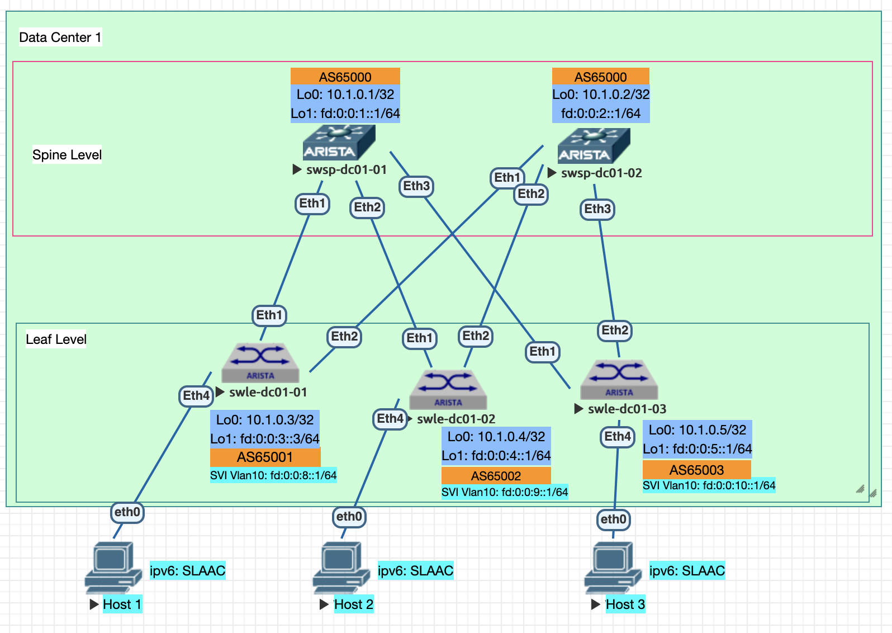

Домашнее задание

VxLAN. L3VNI
Цель:

Настроить маршрутизацию в рамках Overlay между клиентами

Описание/Пошаговая инструкция выполнения домашнего задания:

В этой самостоятельной работе мы ожидаем, что вы самостоятельно:

    - Настроите каждого клиента в своем VNI
    - Настроите маршрутизацию между клиентами.
    - Зафиксируете в документации - план работы, адресное пространство, схему сети, конфигурацию устройств

Документация оформлена на github в файле Readme.md(markdown). Каждая лабораторная работа находится в своей директории. Пример работы можно посмотреть тут

-------------------


### 2. Адресный план и правила именования коммутаторов:

Протокол eBGP настривается для работы с IPv6 адресацией.
      
- Общий план адресов ipv4: 10.0.0.0/8;
- Адреса для Loopback интерфейсов ipv4: 10.00[DC num].0.0/23, 512 устройств на 1 DC;
- #### Адреса для Loopback интерфейсов ipv6: fd::/61 в соответствии с таблицей №1;
- Линковые адреса ipv4: 10.10[DC_num].16.0/20, для линковых сетей использовать /31, младший адрес на стороне Spine;
- #### Линковые адреса ipv6: link-local
- Правила именования коммутаторов:
   - Spine Hostname: swsp-dc0[DC_num]-num
   - Leaf Hostname: swle-dc0[DC_num]-num
- Линковые интерфейсы для стека ipv4: основной интерфейс Eth [0..n] //сохраняю для будущих лаб, не используется в данной лабе
- #### Линковые интерфейсы для стека ipv6: подинтерфейс Eth [0..n].10, с тэгом 802.1q 10
  
#### Таблица №1 Имена хостов и адреса Loopback
| Коммутатор  | Hostname  |  IP Loopback 0 | IP Loopback 1 | BGP AS Number |
| :------------ |:---------------:| -----:| ---------------:| -------------:|
| Spine 1      | swsp-dc01-01 | 10.1.0.1 | fd:0:0:1::1/64 | 65000 |
| Spine 2      | swsp-dc01-02 |   10.1.0.2 | fd:0:0:2:1/64 | 65000 |
| Leaf 1 | swle-dc01-01 |    10.1.0.3 | fd:0:0:3::1/64 | 65001 |
| Leaf 2 | swle-dc01-02 |    10.1.0.4 | fd:0:0:4::1/64 | 65002 |
| Leaf 3 | swle-dc01-03 |    10.1.0.5 | fd:0:0:5::1/64 | 65003 |

#### Таблица №2 Настройки интерфейсов клиентов
| Коммутатор  | IPv4 адрес |  IPv4 шлюза |  IPv6 router |  IPv4 интерфейса хоста |
| :------------ |:---------------:| -----:| ---------------:| -----:| 
| Host-1 | 192.168.1.1/24 |     192.168.1.254/24 | fd:0:0:8::1/64 |     SLAAC | 
| Host-2 | 192.168.2.1/24 |    192.168.2.254/24 | fd:0:0:9::1/64 |    SLAAC | 
| Host-3 | 192.168.3.1/24 |    192.168.3.254/24 | fd:0:0:10::1/64 |   SLAAC |

#### Таблица №3 Настройки VRF
| Коммутатор  | VRF | RD | RT Both |
| :------------ |:---------------:| -----:| ---------------:|
| swle-dc01-01 (Leaf-1)| VPN.6500.10 |     65000:10 | 65000:10 |
| swle-dc01-02 (Leaf-2) | VPN.6500.20 |    65000:20 | 65000:10 |
| swle-dc01-03 (Leaf-3) | VPN.6500.30 |    65000:30 | 65000:10 |

***Route Target выбраны одинаковыми для упрощения настройки импорта маршрутов*** 


  


### 3. План выполнения работ
#### 3.1 Подготовительные работы
- Выполнена коммутация согласно п.2, настроены линковые интерфейсы и интерфейсы Loopback 1 с ipv6 адресами согласно таблицы №1
- Настроен eBGP в underlay в adress-family ipv6
- Включен service routing protocols model multi-agent
  
#### 3.2 Создать vlan 10 и настроить клиентские интерфейс 
```
vlan 10
   name vlan10

interface Ethernet4
   description - client HOST
   switchport access vlan 10
   spanning-tree portfast
```                        

#### 3.3 Фрагмент конфигурации процесса BGP на устройстве Leaf-2:

- активировать сессию для AF: evpn
- настроить IP-VRF для каждого leaf:
  -- VPN.6500.10 RD 65000:10, RT: 65000:10
  -- VPN.6500.20 RD 65000:20  RT: 65000:10
  -- VPN.6500.30 RD 65000:30 RT: 65000:10

- фрагмент конфигурации leaf-1:
```
vrf instance VPN.6500.10

ipv6 unicast-routing vrf VPN.6500.10

router bgp 65003
   router-id 10.1.0.5
   no bgp default ipv4-unicast
   bgp default ipv6-unicast
   graceful-restart restart-time 120
   maximum-paths 10
   neighbor spine-1 peer group
   neighbor spine-1 bfd
   neighbor spine-1 timers 20 60
   neighbor spine-1 route-map in-as-path in
   neighbor spine-1 graceful-restart
   neighbor spine-1 send-community extended
   neighbor spine-2 peer group
   neighbor spine-2 bfd
   neighbor spine-2 timers 20 60
   neighbor spine-2 route-map in-as-path in
   neighbor spine-2 graceful-restart
   neighbor spine-2 send-community extended
   neighbor fe80::5200:ff:fe03:3766%Et2.10 peer group spine-2
   neighbor fe80::5200:ff:fe03:3766%Et2.10 remote-as 65000
   neighbor fe80::5200:ff:fed5:5dc0%Et1.10 peer group spine-1
   neighbor fe80::5200:ff:fed5:5dc0%Et1.10 remote-as 65000
   !
   address-family evpn
      neighbor spine-1 activate
      neighbor spine-2 activate
   !
   address-family ipv6
      neighbor spine-1 activate
      neighbor spine-2 activate
      network fd::/61
      redistribute connected route-map rc6-map
   !
   vrf VPN.6500.10
      rd 65000:10
      route-target import evpn 65000:10
      route-target export evpn 65000:10
      redistribute connected
```

##### 3.4 Настроить тунельный интерфейс VTEP:
```
interface Vxlan1
   vxlan source-interface Loopback1
   vxlan udp-port 4789
   vxlan encapsulation ipv6
   vxlan vrf VPN.6500.10 vni 10010
   vxlan vrf VPN.6500.20 vni 30030
   vxlan vrf VPN.6500.30 vni 30030
```

##### 3.5 Настроить SVI интерфейс Vlan10:

***ОПЫТНЫМ ПУТЕМ ОБНАРУЖЕНА НЕОБХОДИМОСТЬ ВКЛЮЧЕНИЯ ipv4 на SVI ИНАЧЕ НЕ АНОНСИРУЮТСЯ МАРШРУТЫ ipv6***
```
interface Vlan10
   vrf VPN.6500.10
   ip address unnumbered Loopback0
   ipv6 enable
   ipv6 address fd:0:0:8::1/64
```

### 4 Выполнить контроль и проверки


- убедиться в наличии соседских отношений для evpn:

```
swle-dc01-01#sh bgp evpn summary
BGP summary information for VRF default
Router identifier 10.1.0.3, local AS number 65001
Neighbor Status Codes: m - Under maintenance
  Neighbor                       V AS           MsgRcvd   MsgSent  InQ OutQ  Up/Down State   PfxRcd PfxAcc
  fe80::5200:ff:fe03:3766%Et2.10 4 65000          71201     71329    0    0 00:07:39 Estab   4      4
  fe80::5200:ff:fed5:5dc0%Et1.10 4 65000          23964     23961    0    0 00:27:21 Estab   4      4
```

- Проверить состояние туннельного интерфейса, убедиться в корректности source interface и наличии vni для VPN:

```
swle-dc01-01#sh int vxlan 1
Vxlan1 is up, line protocol is up (connected)
  Hardware is Vxlan
  Source interface is Loopback1 and is active with fd:0:0:3::1
  Listening on UDP port 4789
  Vxlan Encapsulation is IPv6
  Replication/Flood Mode is headend with Flood List Source: CLI
  Remote MAC learning is disabled
  VNI mapping to VLANs
  Static VLAN to VNI mapping is
  Dynamic VLAN to VNI mapping for 'evpn' is
    [4068, 30030]     [4069, 10010]     [4088, 20020]
  Note: All Dynamic VLANs used by VCS are internal VLANs.
        Use 'show vxlan vni' for details.
  Static VRF to VNI mapping is
   [VPN.6500.10, 10010]
   [VPN.6500.20, 20020]
   [VPN.6500.30, 30030]
  Shared Router MAC is 0000.0000.0000

swle-dc01-01#sh vxlan vni
VNI to VLAN Mapping for Vxlan1
VNI       VLAN       Source       Interface       802.1Q Tag
--------- ---------- ------------ --------------- ----------

VNI to dynamic VLAN Mapping for Vxlan1
VNI         VLAN       VRF               Source
----------- ---------- ----------------- ------------
10010       4069       VPN.6500.10       evpn
20020       4088       VPN.6500.20       evpn
30030       4068       VPN.6500.30       evpn
```

- Убедиться в наличии маршрутов 'route-type 5' по evpn fd:0:0:[8,9,10]::/64, подтверждаем работу ECMP:
  
```
swle-dc01-01#sh bgp evpn
BGP routing table information for VRF default
Router identifier 10.1.0.3, local AS number 65001
Route status codes: * - valid, > - active, S - Stale, E - ECMP head, e - ECMP
                    c - Contributing to ECMP, % - Pending BGP convergence
Origin codes: i - IGP, e - EGP, ? - incomplete
AS Path Attributes: Or-ID - Originator ID, C-LST - Cluster List, LL Nexthop - Link Local Nexthop

          Network                Next Hop              Metric  LocPref Weight  Path
 * >      RD: 65000:10 ip-prefix fd:0:0:8::/64
                                 -                     -       -       0       i
 * >Ec    RD: 65000:20 ip-prefix fd:0:0:9::/64
                                 fd:0:0:4::1           -       100     0       65000 65002 i
 *  ec    RD: 65000:20 ip-prefix fd:0:0:9::/64
                                 fd:0:0:4::1           -       100     0       65000 65002 i
 * >Ec    RD: 65000:30 ip-prefix fd:0:0:10::/64
                                 fd:0:0:5::1           -       100     0       65000 65003 i
 *  ec    RD: 65000:30 ip-prefix fd:0:0:10::/64
                                 fd:0:0:5::1           -       100     0       65000 65003 i
```
- На примере префикса с leaf-2 для vni 20020 проверяем наличие корректного маршрута в BGP таблице: 
  
```
swle-dc01-01#sh bgp evpn route-type ip-prefix ipv6 vni 20020 detail
BGP routing table information for VRF default
Router identifier 10.1.0.3, local AS number 65001
BGP routing table entry for ip-prefix fd:0:0:9::/64, Route Distinguisher: 65000:20
 Paths: 2 available
  65000 65002
    fd:0:0:4::1 from fe80::5200:ff:fed5:5dc0%Et1.10 (10.1.0.1)
      Origin IGP, metric -, localpref 100, weight 0, tag 0, valid, external, ECMP head, ECMP, best, ECMP contributor
      Extended Community: Route-Target-AS:65000:10 TunnelEncap:tunnelTypeVxlan EvpnRouterMac:50:00:00:cb:38:c2
      VNI: 20020
  65000 65002
    fd:0:0:4::1 from fe80::5200:ff:fe03:3766%Et2.10 (10.1.0.2)
      Origin IGP, metric -, localpref 100, weight 0, tag 0, valid, external, ECMP, ECMP contributor
      Extended Community: Route-Target-AS:65000:10 TunnelEncap:tunnelTypeVxlan EvpnRouterMac:50:00:00:cb:38:c2
      VNI: 20020
```

- Убедиться в наличии маршрутов в VPN:
```
swle-dc01-01#sh ipv6 route vrf VPN.6500.10

VRF: VPN.6500.10
Displaying 3 of 7 IPv6 routing table entries
Codes: C - connected, S - static, K - kernel, O3 - OSPFv3,
       B - Other BGP Routes, A B - BGP Aggregate, R - RIP,
       I L1 - IS-IS level 1, I L2 - IS-IS level 2, DH - DHCP,
       NG - Nexthop Group Static Route, M - Martian,
       DP - Dynamic Policy Route, L - VRF Leaked,
       RC - Route Cache Route

 C        fd:0:0:8::/64 [0/0]
           via Vlan10, directly connected
 B E      fd:0:0:9::/64 [200/0]
           via VTEP fd:0:0:4::1 VNI 20020 router-mac 50:00:00:cb:38:c2 local-interface Vxlan1
 B E      fd:0:0:10::/64 [200/0]
           via VTEP fd:0:0:5::1 VNI 30030 router-mac 50:00:00:15:f4:e8 local-interface Vxlan1
```

-  ping между хостом подключенным к Leaf-1 и SVI интерфейсами Leaf-2,3
```
swle-dc01-01#ping vrf VPN.6500.10 fd:0:0:9::1
PING fd:0:0:9::1(fd:0:0:9::1) 52 data bytes
60 bytes from fd:0:0:9::1: icmp_seq=1 ttl=64 time=88.1 ms
60 bytes from fd:0:0:9::1: icmp_seq=2 ttl=64 time=86.7 ms
60 bytes from fd:0:0:9::1: icmp_seq=3 ttl=64 time=94.8 ms
60 bytes from fd:0:0:9::1: icmp_seq=4 ttl=64 time=97.5 ms
60 bytes from fd:0:0:9::1: icmp_seq=5 ttl=64 time=98.4 ms

--- fd:0:0:9::1 ping statistics ---
5 packets transmitted, 5 received, 0% packet loss, time 48ms
rtt min/avg/max/mdev = 86.799/93.155/98.412/4.806 ms, pipe 5, ipg/ewma 12.194/90.992 ms
swle-dc01-01#ping vrf VPN.6500.10 fd:0:0:10::1
PING fd:0:0:10::1(fd:0:0:10::1) 52 data bytes
60 bytes from fd:0:0:10::1: icmp_seq=1 ttl=64 time=45.4 ms
60 bytes from fd:0:0:10::1: icmp_seq=2 ttl=64 time=49.1 ms
60 bytes from fd:0:0:10::1: icmp_seq=3 ttl=64 time=55.1 ms
60 bytes from fd:0:0:10::1: icmp_seq=4 ttl=64 time=59.0 ms
60 bytes from fd:0:0:10::1: icmp_seq=5 ttl=64 time=46.3 ms

--- fd:0:0:10::1 ping statistics ---
5 packets transmitted, 5 received, 0% packet loss, time 88ms
rtt min/avg/max/mdev = 45.408/51.014/59.019/5.248 ms, pipe 4, ipg/ewma 22.001/48.259 ms
```

### 4 Конфигурации устройств
- Spine коммутаторы:
  - [swsp-dc1-1](configs/swsp-dc01-01.conf)
  - [swsp-dc1-2](configs/swsp-dc01-02.conf)
- Leaf коммутаторы:
  - [swle-dc1-1](configs/swle-dc01-01.conf)
  - [swle-dc1-2](configs/swle-dc01-02.conf)
  - [swle-dc1-3](configs/swle-dc01-03.conf)
