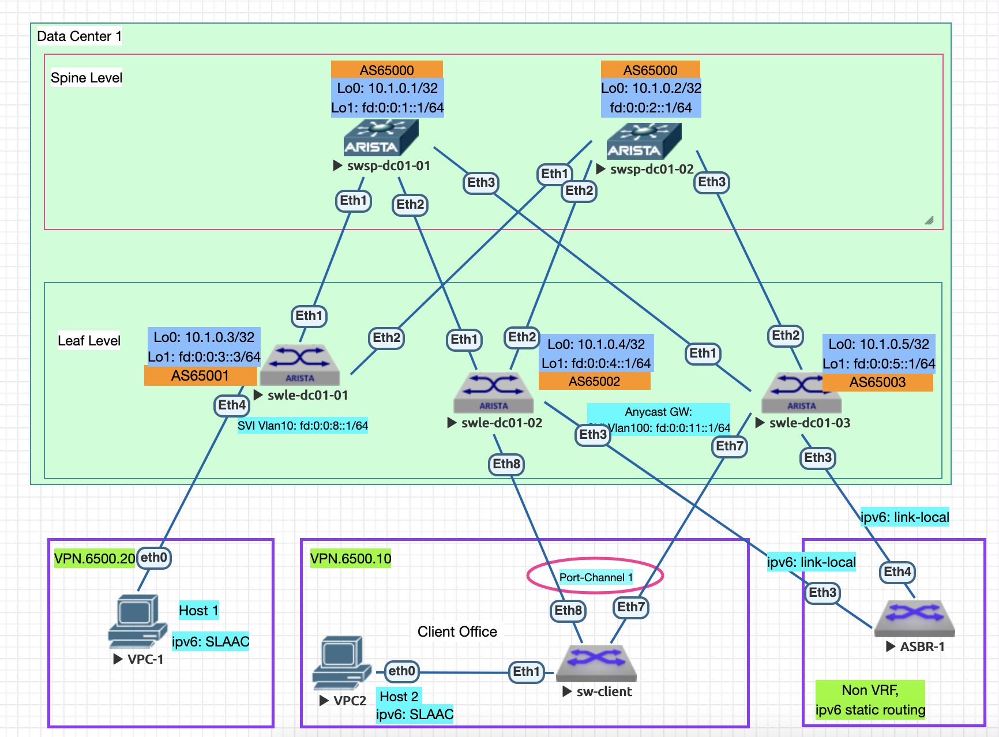

### 1. VxLAN. Routing.
#### Цель:

Реализовать передачу суммарных префиксов через EVPN route-type 5

Описание/Пошаговая инструкция выполнения домашнего задания:

В этой самостоятельной работе мы ожидаем, что вы самостоятельно:

    Разместите двух "клиентов" в разных VRF в рамках одной фабрики.
    Настроите маршрутизацию между клиентами через внешнее устройство (граничный роутер\фаерволл\etc)
    Зафиксируете в документации - план работы, адресное пространство, схему сети, настройки сетевого оборудования

### 2. Адресный план и правила именования коммутаторов:

Протокол eBGP настривается для работы с IPv6 адресацией.
      
- Общий план адресов ipv4: 10.0.0.0/8;
- Адреса для Loopback интерфейсов ipv4: 10.00[DC num].0.0/23, 512 устройств на 1 DC;
- #### Адреса для Loopback интерфейсов ipv6: fd::/61 в соответствии с таблицей №1;
- Линковые адреса ipv4: 10.10[DC_num].16.0/20, для линковых сетей использовать /31, младший адрес на стороне Spine;
- #### Линковые адреса ipv6: link-local
- Правила именования коммутаторов:
   - Spine Hostname: swsp-dc0[DC_num]-num
   - Leaf Hostname: swle-dc0[DC_num]-num
- Линковые интерфейсы для стека ipv4: основной интерфейс Eth [0..n] //сохраняю для будущих лаб, не используется в данной лабе
- #### Линковые интерфейсы для стека ipv6: подинтерфейс Eth [0..n].10, с тэгом 802.1q 10
  
#### Таблица №1 Имена хостов и адреса Loopback
| Коммутатор  | Hostname  |  IP Loopback 0 | IP Loopback 1 | BGP AS Number |
| :------------ |:---------------:| -----:| ---------------:| -------------:|
| Spine 1      | swsp-dc01-01 | 10.1.0.1 | fd:0:0:1::1/64 | 65000 |
| Spine 2      | swsp-dc01-02 |   10.1.0.2 | fd:0:0:2:1/64 | 65000 |
| Leaf 1 | swle-dc01-01 |    10.1.0.3 | fd:0:0:3::1/64 | 65001 |
| Leaf 2 | swle-dc01-02 |    10.1.0.4 | fd:0:0:4::1/64 | 65002 |
| Leaf 3 | swle-dc01-03 |    10.1.0.5 | fd:0:0:5::1/64 | 65003 |

#### Таблица №2 Настройки интерфейсов клиентов
| Клиентское устройство  | IPv4 адрес |  IPv4 шлюза |  IPv6 router |  IPv4 интерфейса хоста |
| :------------ |:---------------:| -----:| ---------------:| -----:| 
| Host-1 | - |     - | fd:0:0:8::1/64 |     SLAAC | 
| Host-2/LACP | - |    - | fd:0:0:11::1/64 |    SLAAC | 
| Host-2/LACP | - |    - | fd:0:0:11::1/64 |   SLAAC |
*** Host-2 подключен через клиентский коммутатор с включенной агрегацией аплинков LACP в режиме Active ***

#### Таблица №3 Настройки VRF
| VRF  | IPv6 network | RD | RT Both |
| :------------ |:---------------:| -----:| ---------------:|
| VPN.6500.10 | fd:0:0:8::1/64 |     65000:10 | 65000:10 |
| VPN.6500.20 | fd:0:0:11::1/64 |    65000:20 | 65000:20 |

  

### 3. План выполнения работ
#### 3.1 Подготовительные работы
- Выполнена коммутация согласно п.2, настроены линковые интерфейсы и интерфейсы Loopback 1 с ipv6 адресами согласно таблицы №1
- Настроен eBGP в underlay в adress-family ipv6
- Используются настройки предыдущей лабораторной работы lab06 (symmetric IRB)
  
#### 3.2 Настроить клиентский коммутатор, создав vlan 100 и Port-channel/LACP/Active:
```
vlan 100
   name vlan100

interface Port-Channel1
   description - Uplink to IP Fabric
   switchport trunk allowed vlan 100
   switchport mode trunk

interface Ethernet8
   description - Uplink to Leaf-2
   channel-group 1 mode active

interface Ethernet7
   description - Uplink to Leaf-3
   channel-group 1 mode active
```                        

#### 3.3 Настроить Port-channel на коммутаторах Leaf-2 и Leaf-3:
- Настроить параметры ESI для Port-Channel:
```
interface Port-Channel1
   description - Client SW
   switchport trunk allowed vlan 100
   switchport mode trunk
   !
   evpn ethernet-segment
      identifier 0000:8888:8888:8888:8888
      route-target import 88:88:88:88:88:88
   lacp system-id 0001.0002.0003
```

##### 3.5 Настроить SVI интерфейс Vlan100 в режиме Anycast GW:

***ОПЫТНЫМ ПУТЕМ ОБНАРУЖЕНА НЕОБХОДИМОСТЬ ВКЛЮЧЕНИЯ ipv4 на SVI ИНАЧЕ НЕ АНОНСИРУЮТСЯ МАРШРУТЫ ipv6***
```
interface Vlan100
   vrf VPN.6500.10
   ip address unnumbered Loopback0
   ipv6 enable
   ipv6 address virtual fd:0:0:11::1/64
```

### 4 Выполнить контроль и проверки


- Убедиться в наличии префиксов с 'route-type 1,4' по evpn/bgp для соседа Leaf-2, Leaf-3 (вывод на примере  Leaf-2):
```
swle-dc01-02#sh bgp evpn next-hop fd:0:0:5::1
BGP routing table information for VRF default
Router identifier 10.1.0.4, local AS number 65002
Route status codes: * - valid, > - active, S - Stale, E - ECMP head, e - ECMP
                    c - Contributing to ECMP, % - Pending BGP convergence
Origin codes: i - IGP, e - EGP, ? - incomplete
AS Path Attributes: Or-ID - Originator ID, C-LST - Cluster List, LL Nexthop - Link Local Nexthop

          Network                Next Hop              Metric  LocPref Weight  Path
 * >Ec    RD: 10.1.0.5:101 auto-discovery 10100 0000:8888:8888:8888:8888
                                 fd:0:0:5::1           -       100     0       65000 65003 i
 *  ec    RD: 10.1.0.5:101 auto-discovery 10100 0000:8888:8888:8888:8888
                                 fd:0:0:5::1           -       100     0       65000 65003 i
 * >Ec    RD: 10.1.0.5:1 auto-discovery 0000:8888:8888:8888:8888
                                 fd:0:0:5::1           -       100     0       65000 65003 i
 *  ec    RD: 10.1.0.5:1 auto-discovery 0000:8888:8888:8888:8888
                                 fd:0:0:5::1           -       100     0       65000 65003 i
 * >Ec    RD: 10.1.0.5:101 imet 10100 fd:0:0:5::1
                                 fd:0:0:5::1           -       100     0       65000 65003 i
 *  ec    RD: 10.1.0.5:101 imet 10100 fd:0:0:5::1
                                 fd:0:0:5::1           -       100     0       65000 65003 i
 * >Ec    RD: 10.1.0.5:101 imet 10101 fd:0:0:5::1
                                 fd:0:0:5::1           -       100     0       65000 65003 i
 *  ec    RD: 10.1.0.5:101 imet 10101 fd:0:0:5::1
                                 fd:0:0:5::1           -       100     0       65000 65003 i
 * >Ec    RD: 10.1.0.5:1 ethernet-segment 0000:8888:8888:8888:8888 fd:0:0:5::1
                                 fd:0:0:5::1           -       100     0       65000 65003 i
 *  ec    RD: 10.1.0.5:1 ethernet-segment 0000:8888:8888:8888:8888 fd:0:0:5::1
                                 fd:0:0:5::1           -       100     0       65000 65003 i
```

- Проверка состояния Port-channel1 на Leaf-2: 
  
```
swle-dc01-02#sh int po1
Port-Channel1 is up, line protocol is up (connected)
  Hardware is Port-Channel, address is 5000.0002.0008
  Description: - Client SW
```

- Выполнить проверку - ping с Host-2 до соседнего коммутатора fd:0:0:8::1/64, отключать поочередно физические порты uplink на коммутаторе доступа sw-client (eth 8, eth 7):
  
```
client-sw#show port-channel 1 detailed 
Port Channel Port-Channel1 (Fallback State: Unconfigured):
Minimum links: unconfigured
Minimum speed: unconfigured
Current weight/Max weight: 1/16
  Active Ports:
       Port            Time Became Active       Protocol       Mode      Weight
    --------------- ------------------------ -------------- ------------ ------
       Ethernet7       20:23:45                 LACP           Active      1   

  Configured, but inactive ports:
       Port            Time Became Inactive    Reason                       
    --------------- -------------------------- -----------------------------
       Ethernet8       21:11:05                link down in LACP negotiation
```
- в результате падает физический линк на Leaf-2:
```
swle-dc01-02#sh int po1
Port-Channel1 is down, line protocol is lowerlayerdown (notconnect)
  Hardware is Port-Channel, address is 5000.0002.0008
  Description: - Client SW
```
- однако, связаность сохраняется, так как работает ESI LAG:
```
VPCS> ping fd:0:0:8::1
fd:0:0:8::1 icmp6_seq=1 ttl=63 time=62.799 ms
fd:0:0:8::1 icmp6_seq=2 ttl=63 time=38.218 ms
fd:0:0:8::1 icmp6_seq=3 ttl=63 time=56.361 ms
fd:0:0:8::1 icmp6_seq=4 ttl=63 time=67.949 ms
fd:0:0:8::1 icmp6_seq=5 ttl=63 time=57.554 ms
```
***при этом на коммутаторе Leaf-3 пропадают evpn маршруты типом 1 и 4***

- при восстановлении физического линка (участника LACP), появляются необходимые для работы MultiHome префиксы, проверка на Leaf-3:
```
swle-dc01-03#sh bgp evpn next-hop fd:0:0:4::1 esi 0000:8888:8888:8888:8888
BGP routing table information for VRF default
Router identifier 10.1.0.5, local AS number 65003
Route status codes: * - valid, > - active, S - Stale, E - ECMP head, e - ECMP
                    c - Contributing to ECMP, % - Pending BGP convergence
Origin codes: i - IGP, e - EGP, ? - incomplete
AS Path Attributes: Or-ID - Originator ID, C-LST - Cluster List, LL Nexthop - Link Local Nexthop

          Network                Next Hop              Metric  LocPref Weight  Path
 * >Ec    RD: 10.1.0.4:1 auto-discovery 0000:8888:8888:8888:8888
                                 fd:0:0:4::1           -       100     0       65000 65002 i
 *  ec    RD: 10.1.0.4:1 auto-discovery 0000:8888:8888:8888:8888
                                 fd:0:0:4::1           -       100     0       65000 65002 i
 * >Ec    RD: 10.1.0.4:101 mac-ip 10100 0050.7966.6808 fd::11:2050:79ff:fe66:6808
                                 fd:0:0:4::1           -       100     0       65000 65002 i
 *  ec    RD: 10.1.0.4:101 mac-ip 10100 0050.7966.6808 fd::11:2050:79ff:fe66:6808
                                 fd:0:0:4::1           -       100     0       65000 65002 i
 * >Ec    RD: 10.1.0.4:1 ethernet-segment 0000:8888:8888:8888:8888 fd:0:0:4::1
                                 fd:0:0:4::1           -       100     0       65000 65002 i
 *  ec    RD: 10.1.0.4:1 ethernet-segment 0000:8888:8888:8888:8888 fd:0:0:4::1
                                 fd:0:0:4::1           -       100     0       65000 65002 i
``` 

### 4 Конфигурации устройств
- Spine коммутаторы:
  - [swsp-dc1-1](configs/swsp-dc01-01.conf)
  - [swsp-dc1-2](configs/swsp-dc01-02.conf)
- Leaf коммутаторы:
  - [swle-dc1-1](configs/swle-dc01-01.conf)
  - [swle-dc1-2](configs/swle-dc01-02.conf)
  - [swle-dc1-3](configs/swle-dc01-03.conf)
