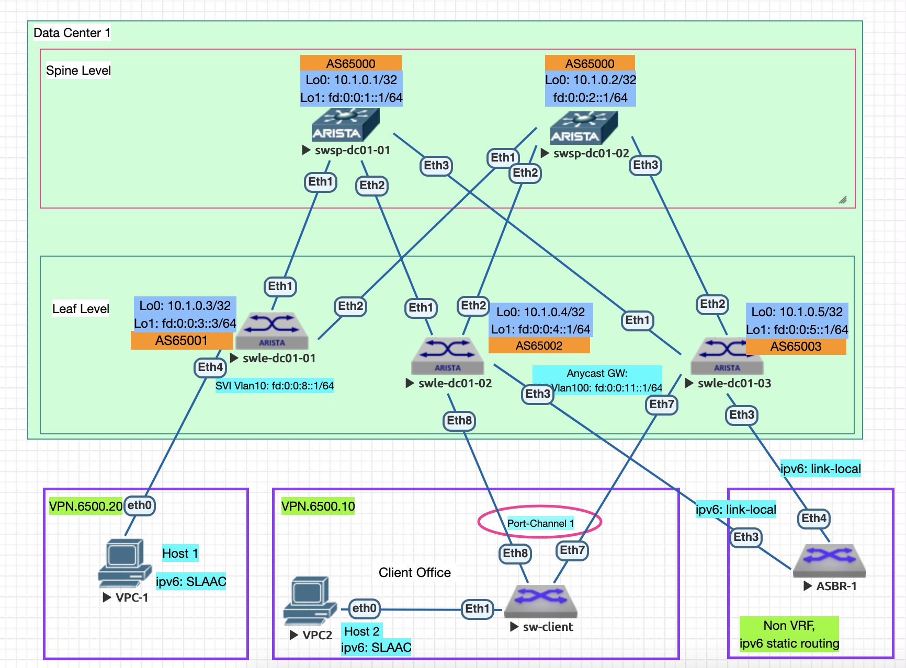

### 1. VxLAN. Routing.
#### Цель:

Реализовать передачу суммарных префиксов через EVPN route-type 5

Описание/Пошаговая инструкция выполнения домашнего задания:

В этой самостоятельной работе мы ожидаем, что вы самостоятельно:

    Разместите двух "клиентов" в разных VRF в рамках одной фабрики.
    Настроите маршрутизацию между клиентами через внешнее устройство (граничный роутер\фаерволл\etc)
    Зафиксируете в документации - план работы, адресное пространство, схему сети, настройки сетевого оборудования

### 2. Адресный план и правила именования коммутаторов:

Протокол eBGP настривается для работы с IPv6 адресацией.
      
- Общий план адресов ipv4: 10.0.0.0/8;
- Адреса для Loopback интерфейсов ipv4: 10.00[DC num].0.0/23, 512 устройств на 1 DC;
- #### Адреса для Loopback интерфейсов ipv6: fd::/61 в соответствии с таблицей №1;
- Линковые адреса ipv4: 10.10[DC_num].16.0/20, для линковых сетей использовать /31, младший адрес на стороне Spine;
- #### Линковые адреса ipv6: link-local
- Правила именования коммутаторов:
   - Spine Hostname: swsp-dc0[DC_num]-num
   - Leaf Hostname: swle-dc0[DC_num]-num
- Линковые интерфейсы для стека ipv4: основной интерфейс Eth [0..n] //сохраняю для будущих лаб, не используется в данной лабе
- #### Линковые интерфейсы для стека ipv6: подинтерфейс Eth [0..n].10, с тэгом 802.1q 10
  
#### Таблица №1 Имена хостов и адреса Loopback
| Коммутатор  | Hostname  |  IP Loopback 0 | IP Loopback 1 | BGP AS Number |
| :------------ |:---------------:| :-----:| :---------------:| :-------------:|
| Spine 1      | swsp-dc01-01 | 10.1.0.1 | fd:0:0:1::1/64 | 65000 |
| Spine 2      | swsp-dc01-02 |   10.1.0.2 | fd:0:0:2:1/64 | 65000 |
| Leaf 1 | swle-dc01-01 |    10.1.0.3 | fd:0:0:3::1/64 | 65001 |
| Leaf 2 | swle-dc01-02 |    10.1.0.4 | fd:0:0:4::1/64 | 65002 |
| Leaf 3 | swle-dc01-03 |    10.1.0.5 | fd:0:0:5::1/64 | 65003 |

#### Таблица №2 Настройки устройств подключенных к фабрике
| Клиентское устройство  | IPv4 адрес |  IPv4 шлюза |  IPv6 router |  IPv4 интерфейса хоста |
| :------------: |:---------------:| :-----:| :---------------:| :-----:| 
| Host-1 | - |     - | fd:0:0:8::1/64 |     SLAAC | 
| Host-2/LACP | - |    - | fd:0:0:11::1/64 |    SLAAC | 
| Host-2/LACP | - |    - | fd:0:0:11::1/64 |   SLAAC |

*** Host-2 подключен через клиентский коммутатор с включенной агрегацией аплинков LACP в режиме Active ***

#### Таблица №3 Настройки VRF
| VRF  | IPv6 network | RD | RT Both | VNI |
| :------------: |:---------------:| :-----:| :---------------:| :---------------:|
| VPN.6500.10 | fd:0:0:8::1/64 |     65000:10 | 65000:10 | 10010 |
| VPN.6500.20 | fd:0:0:11::1/64 |    65000:20 | 65000:20 | 10020 |

  

### 3. План выполнения работ
#### 3.1 Подготовительные работы
- Выполнена коммутация согласно п.2, настроены линковые интерфейсы и интерфейсы Loopback 1 с ipv6 адресами согласно таблицы №1
- Настроен eBGP в underlay в adress-family ipv6
- Используются настройки предыдущей лабораторной работы lab06 (symmetric IRB)
  
#### 3.2 Настроить клиентский коммутатор, создав vlan 100 и Port-channel/LACP/Active:
```
vlan 100
   name vlan100

interface Port-Channel1
   description - Uplink to IP Fabric
   switchport trunk allowed vlan 100
   switchport mode trunk

interface Ethernet8
   description - Uplink to Leaf-2
   channel-group 1 mode active

interface Ethernet7
   description - Uplink to Leaf-3
   channel-group 1 mode active
```                        

#### 3.3 Настроить Port-channel на коммутаторах Leaf-2 и Leaf-3:
- Настроить параметры ESI для Port-Channel:
```
interface Port-Channel1
   description - Client SW
   switchport trunk allowed vlan 100
   switchport mode trunk
   !
   evpn ethernet-segment
      identifier 0000:8888:8888:8888:8888
      route-target import 88:88:88:88:88:88
   lacp system-id 0001.0002.0003
```

##### 3.5 Настроить SVI интерфейс Vlan100 в режиме Anycast GW:

***ОПЫТНЫМ ПУТЕМ ОБНАРУЖЕНА НЕОБХОДИМОСТЬ ВКЛЮЧЕНИЯ ipv4 на SVI ИНАЧЕ НЕ АНОНСИРУЮТСЯ МАРШРУТЫ ipv6***
```
interface Vlan100
   vrf VPN.6500.10
   ip address unnumbered Loopback0
   ipv6 enable
   ipv6 address virtual fd:0:0:11::1/64
```

### 4 Настройки подключения ASBR-1 к фабрике:
- линковые интерфейсы к коммутаторам Leaf-2 и Leaf-3:
```
interface Ethernet3
   description - Uplink Leaf-2
   no switchport
   ipv6 enable
   ipv6 address fd:0:0:100::2/64
!
interface Ethernet4
   description - Uplink Leaf-3
   no switchport
   ipv6 enable
   ipv6 address fd:0:0:101::2/64
```

- статические маршруты подключаемых клиентских сетей:
```
ipv6 unicast-routing
!
ipv6 route fd:0:0:8::/64 fd:0:0:100::1
ipv6 route fd:0:0:11::/64 fd:0:0:101::1
```
### 4.1 Маршруты и настройки граничных leaf-3 в в VPN.6500.10
- Настройка линкового интерфейса
```
interface Ethernet3
   description - ASBR-1 2/l3
   no switchport
   vrf VPN.6500.10
   ipv6 enable
   ipv6 address fd:0:0:101::1/64
```

- Настройка статических маршрутов fd:0:0:8::/64 VRF VPN.6500.10 и fd:0:0:13::/64 для проверки связности с самим ASBR:
 
```
ipv6 route vrf VPN.6500.10 fd:0:0:8::/64 fd:0:0:101::2
ipv6 route vrf VPN.6500.10 fd:0:0:13::/64 fd:0:0:101::2
```

- Включаем redistribute static для распространения изученных route-type 5:
```
 vrf VPN.6500.10
      rd 65000:10
      route-target import evpn 65000:10
      route-target export evpn 65000:10
      redistribute static
```


### 4.1 Маршруты и настройки граничных leaf-2 в в VPN.6500.20

- линковый интерфейс и маршруты в сторону ASBR для маршрутизации трафика в VPN.6500.10:
```
interface Ethernet3
   description - ASBR-1 1/l3
   no switchport
   vrf VPN.6500.20
   ip address 10.2.2.2/24
   ipv6 enable
   ipv6 address fd:0:0:100::1/64
!
!
ipv6 route vrf VPN.6500.20 fd:0:0:11::/64 fd:0:0:100::2
ipv6 route vrf VPN.6500.20 fd:0:0:13::/64 fd:0:0:100::2
```


### 4 Выполнить контроль и проверки

- проверка наличия маршрутов на Leaf-1 'route-type 5', к которому подключен HOST-1 в VPN.6500.10:
```
swle-dc01-01#sh ipv6 route vrf VPN.6500.20

VRF: VPN.6500.20
Displaying 3 of 7 IPv6 routing table entries
Codes: C - connected, S - static, K - kernel, O3 - OSPFv3,
       B - Other BGP Routes, A B - BGP Aggregate, R - RIP,
       I L1 - IS-IS level 1, I L2 - IS-IS level 2, DH - DHCP,
       NG - Nexthop Group Static Route, M - Martian,
       DP - Dynamic Policy Route, L - VRF Leaked,
       RC - Route Cache Route

 C        fd:0:0:8::/64 [0/0]
           via Vlan10, directly connected
 B E      fd:0:0:11::/64 [200/0]
           via VTEP fd:0:0:4::1 VNI 10020 router-mac 50:00:00:cb:38:c2 local-interface Vxlan1
 B E      fd:0:0:13::/64 [200/0]
           via VTEP fd:0:0:4::1 VNI 10020 router-mac 50:00:00:cb:38:c2 local-interface Vxlan1

swle-dc01-01#sh bgp evpn route-type ip-prefix ipv6 vni 10020
BGP routing table information for VRF default
Router identifier 10.1.0.3, local AS number 65001
Route status codes: * - valid, > - active, S - Stale, E - ECMP head, e - ECMP
                    c - Contributing to ECMP, % - Pending BGP convergence
Origin codes: i - IGP, e - EGP, ? - incomplete
AS Path Attributes: Or-ID - Originator ID, C-LST - Cluster List, LL Nexthop - Link Local Nexthop

          Network                Next Hop              Metric  LocPref Weight  Path
 * >      RD: 65000:20 ip-prefix fd:0:0:8::/64
                                 -                     -       -       0       i
 * >Ec    RD: 65000:20 ip-prefix fd:0:0:11::/64
                                 fd:0:0:4::1           -       100     0       65000 65002 ?
 *  ec    RD: 65000:20 ip-prefix fd:0:0:11::/64
                                 fd:0:0:4::1           -       100     0       65000 65002 ?
 * >Ec    RD: 65000:20 ip-prefix fd:0:0:13::/64
                                 fd:0:0:4::1           -       100     0       65000 65002 ?
 *  ec    RD: 65000:20 ip-prefix fd:0:0:13::/64
                                 fd:0:0:4::1           -       100     0       65000 65002 ?
```

- проверка связности по icmp между Host-1 и Host-2, находящимися в разных VPN:

```
VPCS> ping fd::11:2050:79ff:fe66:6808

fd::11:2050:79ff:fe66:6808 icmp6_seq=1 ttl=56 time=642.785 ms
fd::11:2050:79ff:fe66:6808 icmp6_seq=2 ttl=56 time=158.211 ms
fd::11:2050:79ff:fe66:6808 icmp6_seq=3 ttl=56 time=95.977 ms
fd::11:2050:79ff:fe66:6808 icmp6_seq=4 ttl=56 time=80.859 ms
fd::11:2050:79ff:fe66:6808 icmp6_seq=5 ttl=56 time=68.991 ms
```
- проверка связности между HOST-1 и интерфейсами Leaf-3 в "чужом" VPN.6500.20:
```
VPCS> ping fd:0:0:11::1

fd:0:0:11::1 icmp6_seq=1 ttl=61 time=82.809 ms
fd:0:0:11::1 icmp6_seq=2 ttl=61 time=156.930 ms
fd:0:0:11::1 icmp6_seq=3 ttl=61 time=87.325 ms
fd:0:0:11::1 icmp6_seq=4 ttl=61 time=99.523 ms
fd:0:0:11::1 icmp6_seq=5 ttl=61 time=54.680 ms
```

- проверка связности между HOST-1 и интерфейсом Loopback ASBR-1:
```
VPCS> ping fd:0:0:13::1

fd:0:0:13::1 icmp6_seq=1 ttl=62 time=57.369 ms
fd:0:0:13::1 icmp6_seq=2 ttl=62 time=52.308 ms
fd:0:0:13::1 icmp6_seq=3 ttl=62 time=58.572 ms
fd:0:0:13::1 icmp6_seq=4 ttl=62 time=37.472 ms
fd:0:0:13::1 icmp6_seq=5 ttl=62 time=49.787 ms
```


### 4 Конфигурации устройств
- Spine коммутаторы:
  - [swsp-dc1-1](configs/swsp-dc01-01.conf)
  - [swsp-dc1-2](configs/swsp-dc01-02.conf)
- Leaf коммутаторы:
  - [swle-dc1-1](configs/swle-dc01-01.conf)
  - [swle-dc1-2](configs/swle-dc01-02.conf)
  - [swle-dc1-3](configs/swle-dc01-03.conf)
